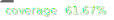

# Air Pollution Visualizer

The aim of this project is to display the current air quality on a given place rendered as a "pollution-level cloud" on 3D map tiles.

This is a project to study Google Maps APIs and how to work with CesiumJs viewer.

## Development

This project was generated with [Angular CLI](https://github.com/angular/angular-cli) version 17.0.10 and uses Tailwind for layouting and styling.

## Development server

Run `npm start` for a dev server. Navigate to `http://localhost:4300/`. The application will automatically reload if you change any of the source files.

## Code scaffolding

Run `ng generate component component-name` to generate a new component. You can also use `ng generate directive|pipe|service|class|guard|interface|enum|module`.

## Build

Run `npm run build` to build the project. The build artifacts will be stored in the `dist/` directory.

## Running unit tests

Run `npm run test` to execute the unit tests via [Karma](https://karma-runner.github.io).

Remember to run `coverage-badges-cli --output src/assets/badges/badges.svg` before commiting to update the coverage badge.

